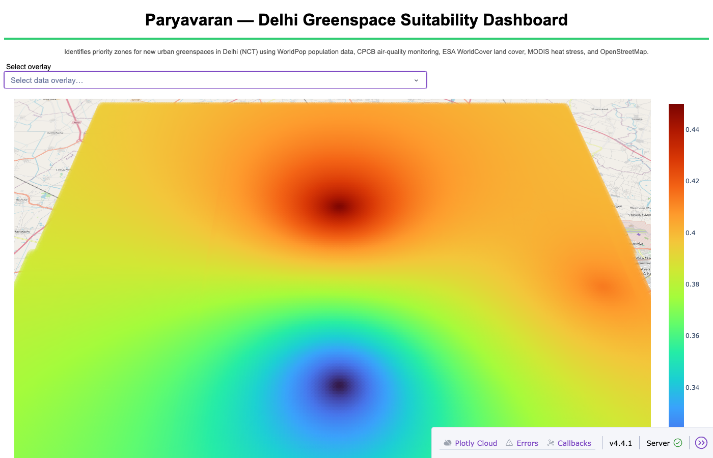
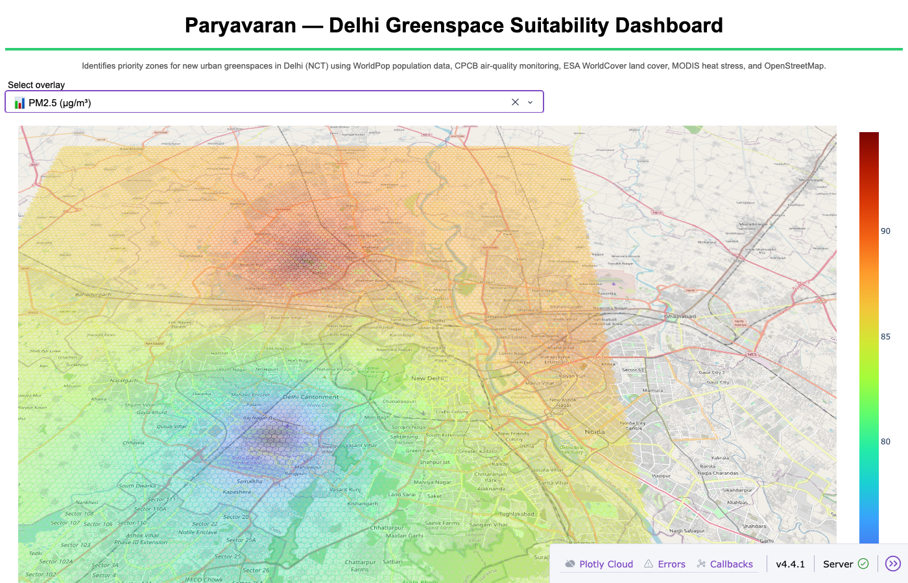

# Paryavaran — Urban Greenspace Suitability Dashboard
### Delhi NCT, India

> Adapted from the Kainos ASDI Hackathon project.  
> Replaces all UK/Ordnance Survey dependencies with Indian open-data sources.

---

## What it does

Identifies high-priority zones for new urban greenspaces in Delhi NCT by combining:

| Signal | Source | Method |
|--------|--------|--------|
| **Population need** | WorldPop India 2024 (100 m) | Raster aggregation → 250 m grid |
| **Air pollution** | CPCB monitoring stations (data.gov.in) | Distance-weighted KNN |
| **Land cover** | ESA WorldCover 2021 (10 m) | Zonal statistics |
| **Heat stress** | MODIS MOD11A2 summer mean LST | Raster aggregation |
| **Parks / roads / POIs** | OpenStreetMap (Geofabrik India) | Vector intersection |
| **Building density** | Google Open Buildings V3 | Footprint fraction per cell |

**Priority score formula:**
```
Priority = (
    0.25 × Population Need
  + 0.20 × Greenspace Deficit
  + 0.20 × Heat Stress
  + 0.15 × Air Pollution
  + 0.10 × Accessibility Deficit
  + 0.10 × Building Density
) × Land Feasibility Multiplier
```

---

## Data pipeline

```
Scripts/build_land_type_csv.py
        ↓
land_type_025.csv  (250 m grid + all feature columns)
        ↓
Notebooks/create_penultimate_df.ipynb  →  penultimate_df.csv
        ↓
Notebooks/create_final_df.ipynb        →  final_df.csv
        ↓
Plotly_Dash_App/app.py                 →  http://127.0.0.1:8050
```

---

## Project structure

```
Paryavaran/
├── helpers.py                    ← Core feature engineering + scoring
├── Enums/
│   └── land_type.py              ← India-specific land type enum
├── Notebooks/
│   ├── create_penultimate_df.ipynb
│   └── create_final_df.ipynb
├── Scripts/
│   └── build_land_type_csv.py    ← Pre-processing: grid + rasters + OSM
├── Plotly_Dash_App/
│   └── app.py                    ← Dash dashboard (centred on Delhi)
├── Dashboard_Images/             ← Screenshots of the Delhi dashboard
│   ├── Priority_Score_Delhi.jpg
│   └── Air_Quality_Delhi.jpg
├── Data/                         ← Downloaded datasets go here (gitignored)
│   ├── worldpop_india_2024_100m.tif
│   ├── worldcover_delhi.tif
│   ├── modis_lst_summer_mean.tif
│   ├── open_buildings_delhi.gpkg
│   └── cpcb_stations.csv
├── points_df_025.csv             ← Generated 250 m Delhi grid
├── land_type_025.csv             ← Generated feature grid
├── penultimate_df.csv            ← Generated intermediate features
├── final_df.csv                  ← Generated final scored dataset
├── requirements.txt
└── .env_template
```

---

## Setup

### 1. Install dependencies

```bash
pip install -r requirements.txt
```

Key additions over the original Kainos requirements:
- `rasterio`, `rasterstats` — read/aggregate GeoTIFF rasters
- `osmnx` — download OpenStreetMap features
- `geopandas`, `pyproj`, `fiona` — vector GIS
- `scipy` — spatial interpolation

### 2. Download datasets

Create a `Data/` directory and download the following:

| File | Source | Notes |
|------|--------|-------|
| `worldpop_india_2024_100m.tif` | [WorldPop India 2024](https://hub.worldpop.org/geodata/summary?id=50771) | Clip to Delhi bbox |
| `worldcover_delhi.tif` | [ESA WorldCover](https://esa-worldcover.org/en/data-access) | 10 m; tile N28E077 |
| `modis_lst_summer_mean.tif` | [NASA LP DAAC MOD11A2](https://lpdaac.usgs.gov/) | Summer (Apr–Jun) mean; ~1 km |
| `open_buildings_delhi.gpkg` | [Google Open Buildings](https://sites.research.google/gr/open-buildings/) | Filter to Delhi bbox |
| `cpcb_stations.csv` | [data.gov.in CPCB AQI](https://www.data.gov.in/catalog/real-time-air-quality-index) | Columns: Latitude, Longitude, PM25, PM10, NO2 |

OSM data is downloaded automatically via `osmnx` during `build_land_type_csv.py`.

**Delhi NCT approximate bounding box:**
```
Bottom-left (SW): 28.40°N, 76.84°E
Top-right   (NE): 28.88°N, 77.35°E
```

### 3. Run the pipeline

```bash
# Step 1 – build grid and feature CSV
python Scripts/build_land_type_csv.py

# Step 2 – generate penultimate_df.csv
jupyter nbconvert --to notebook --execute Notebooks/create_penultimate_df.ipynb

# Step 3 – generate final_df.csv
jupyter nbconvert --to notebook --execute Notebooks/create_final_df.ipynb

# Step 4 – launch dashboard
cd Plotly_Dash_App
python app.py
# → open http://127.0.0.1:8050
```

---

## Dashboard Screenshots

### 🏆 Priority Score Map (Delhi)


### 📊 Air Quality Score


### 📊 Population Density


### 📊 PM2.5 Concentration


### 📊 NO2 Concentration


---

## Dashboard overlays

| Overlay | Description |
|---------|-------------|
| 🏆 Priority Score | Combined suitability score (higher = more suitable) |
| 📊 Air Quality Score | Normalised CPCB PM2.5/PM10/NO2 composite |
| 📊 Population Density | WorldPop 250 m aggregated count |
| 📊 PM2.5 / PM10 / NO₂ | Raw CPCB pollutant concentrations |
| 📊 Heat Stress (LST K) | MODIS summer land-surface temperature |
| 📊 Building Density | Google Open Buildings footprint fraction |
| 📊 Distance to Nearest Green Space | Haversine km to nearest 3 OSM parks |
| 🗺️ Existing Green Spaces | OSM parks/forests + WorldCover tree/grass |
| 🗺️ Water Bodies / Wetlands | WorldCover + OSM water |
| 🗺️ Airports / Railway / Roads | OSM infrastructure constraints |
| 🗺️ Hospitals / Schools | OSM POI vulnerability layers |
| 🗺️ Bare Land / Cropland | WorldCover candidate land |

---

## Key differences from original Kainos project

| Component | Original (London/UK) | This version (Delhi/India) |
|-----------|---------------------|----------------------------------|
| Population | KNN pickle model | WorldPop 100 m raster aggregation |
| Air quality | Sentinel-5P satellite KNN pickles | CPCB station KNN (PM2.5, PM10, NO2) |
| Land type | Ordnance Survey WFS API | ESA WorldCover + OSM (no API key needed) |
| Heat | — | MODIS MOD11A2 LST |
| Buildings | OS Zoomstack | Google Open Buildings V3 |
| Grid centre | London 51.50°N, 0.13°E | Delhi NCT 28.61°N, 77.21°E |
| Priority score | AQ + pop + distance × OS penalties | India 6-component weighted formula |
| API keys required | 5 OS Data Hub keys | None (all open data) |

---

## Attribution

- **WorldPop** — CC BY 4.0, University of Southampton
- **ESA WorldCover** — CC BY 4.0, ESA / Vito
- **OpenStreetMap** — ODbL, OpenStreetMap contributors
- **Google Open Buildings** — CC BY 4.0 / ODbL, Google
- **MODIS LST** — NASA/USGS, public domain
- **CPCB Air Quality** — Government of India Open Government Data (OGD)
